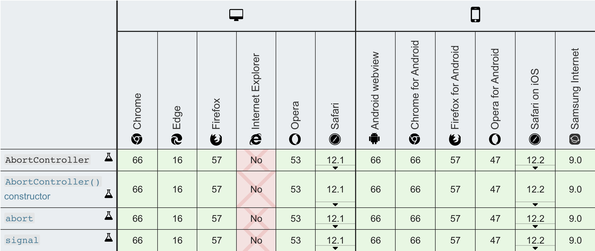

AbortController 인터페이스는 하나 이상의 웹 요청을 취소할 수 있게 해준다.

[`AbortController.AbortController()`](https://developer.mozilla.org/ko/docs/Web/API/AbortController/AbortController) 생성자를 사용해 새로운 `AbortController` 를 생성한다. [`AbortSignal`](https://developer.mozilla.org/ko/docs/Web/API/AbortSignal) 객체를 사용해 DOM 요청과의 통신이 완료된다.

> AbortController 인터페이스

```ts
interface AbortController {
  // DOM 요청과 통신하거나 취소하는데 사용되는 AbortSignal 객체 인터페이스를 반환한다.
  readonly signal: AbortSignal;
  
  //DOM 요청이 완료되기 전에 취소한다. 이를 통해 fetch 요청, 모든 응답 Body 소비, 스트림을 취소할 수 있다.
  abort(): void;
}
```

<br>

### 예시

```ts
let controller = new AbortController();
fetch(url, {
  signal: controller.signal
});

controller.abort();
```

위의 코드를 보면 controller인스턴스를 생성한 후에 fetch할 때, 파라미터 값 signal에 controller.signal을 넘겨주면 등록이 된다.

그 후, controller.abort()를 호출하면 프로미스 객체는 'AbortError'에러를 던지고 reject한다.

```ts
let controller = new AbortController();
let signal = controller.signal;

// triggers when controller.abort() is called
signal.addEventListener('abort', () => alert("abort!"));

controller.abort(); // abort!

alert(signal.aborted); // true
```

또한, signal에 이벤트를 등록하면 abort가 되었는지 추적할 수 도 있다.

<br>

Node.js V15.0.0에서는 AbortController 기능을 지원할 예정이다. 

>  [nodejs 공식문서](https://nodejs.org/docs/latest-v15.x/api/globals.html#globals_class_abortcontroller)

<br>

> 브라우저 호환성



<br>

> ## 참조 및 참고
>
> - [AbortController-MDN](https://developer.mozilla.org/ko/docs/Web/API/AbortController)
>
> - [Fetch: Abort](https://ko.javascript.info/fetch-abort)
>
> 

