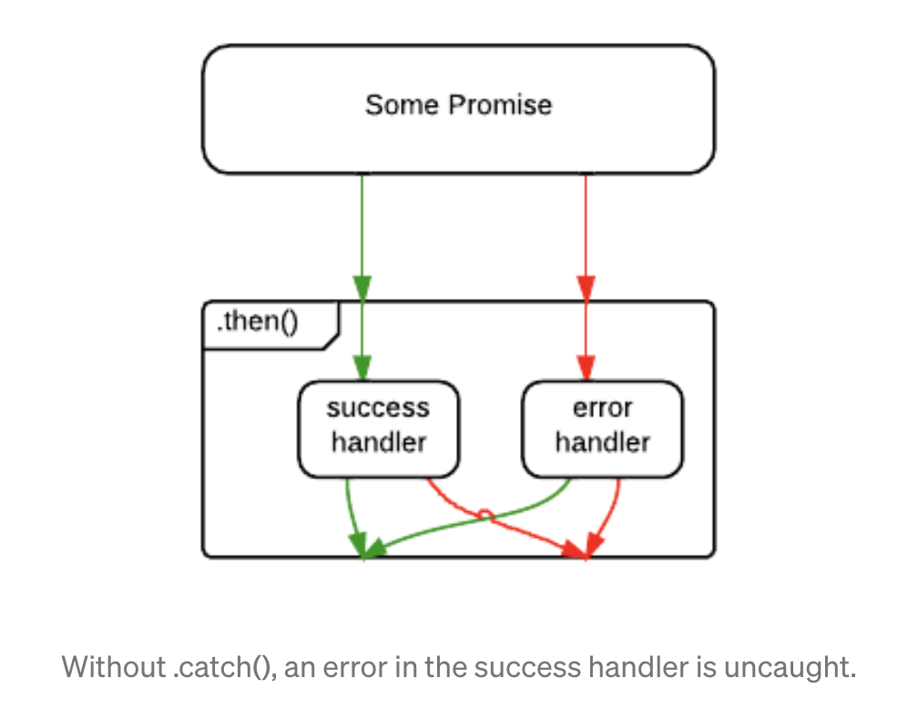
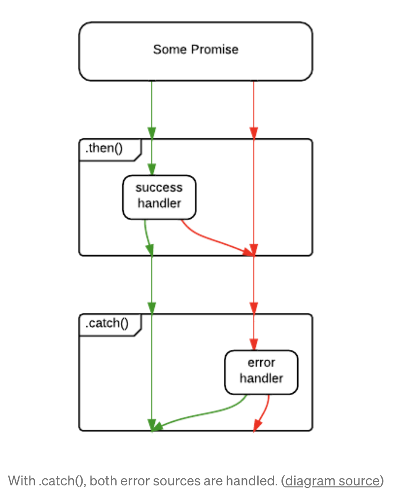

### Error Handling

에러 처리 방법에는 다음과 같이 2가지 방법이 있다.

1. `then()`의 두 번째 인자로 에러를 처리하는 방법

```js
save().then(
  handleSuccess,
  handleError
);
```

2. `catch()`를 이용하는 방법

```js
save().then().catch();
```

위 2가지 방법 모두 프로미스의 `reject()` 메서드가 호출되어 실패 상태가 된 경우에 실행된다. 

하지만, 만약에 `handleSuccess()`가 에러를 던지면 어떻게 될까? `.then()`에서 반환된 프로미스는 rejected 되지만, rejection을 catch할 수 있는 방법이 없다. 

`save()` 작업에서 발생하는 오류는 catch가 되지만 `handleSuccess()` 함수에서 발생하는 오류는 잡을 수 없다.



<br>

두 번째 예제에서 `.catch()`는 `save()` 또는 `handleSuccess()`의 rejections을 처리한다.



<br>

> 또한 이런 방식으로 처리해줄 수도 있다.

```js
save()
  .then(
    handleSuccess,
    handleNetworkError
  )
  .catch(handleProgrammerError);
```

<br>

> ## 참조 및 출처
>
> - [Master the JavaScript Interview: What is a Promise?](https://medium.com/javascript-scene/master-the-javascript-interview-what-is-a-promise-27fc71e77261)
> - [자바스크립트 Promise 쉽게 이해하기](https://joshua1988.github.io/web-development/javascript/promise-for-beginners/)

