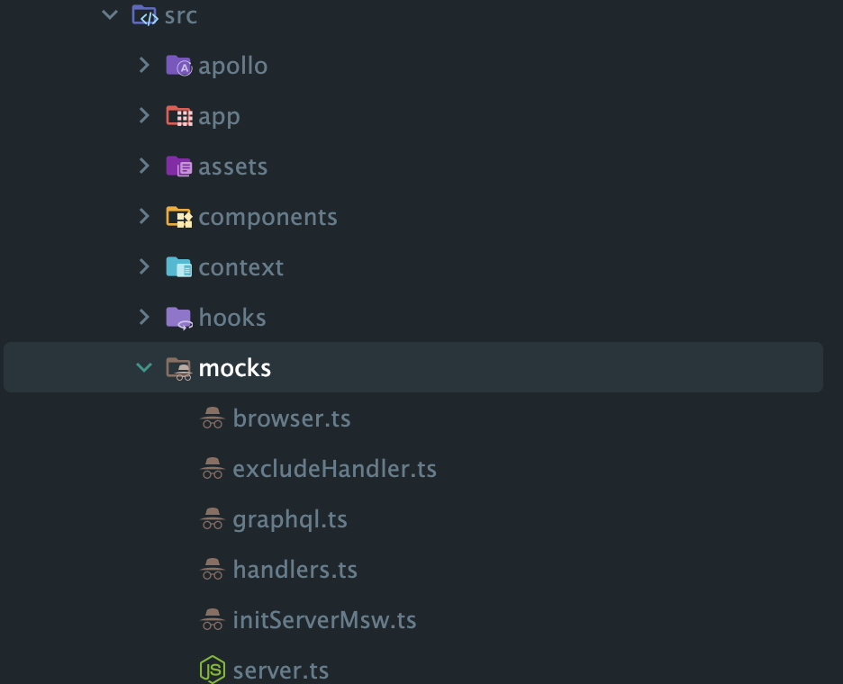

## 문제 배경

Next.js 15 + GraphQL 조합에서 msw(2.6.6.)를 적용하면 msw의 인터셉터 함수가 GraqphQL의 operation 함수를 가로채지(intercept) 못하는 문제가 발생한다.

아래의 글을 보면 어떤 문제가 발생하고 있는지 자세히 확인 할 수 있다.

https://github.com/mswjs/msw/discussions/1049

## **문제 해결 방법**

GraphQL api를 가로챌 방법이 없으니 다른 방법을 고안해야했다(?)

그것은 바로, REST api의 POST 메소드를 활용해서 api를 가로채는 것이다.


GraphQL api를 요청하는 방법을 생각해보면 하나의 endpoint에 `POST` 메소드를 통해서 요청한다. 그리고, 네트워크 탭의`Payload` 에서 확인하면 알 수 있듯이 `operationName`,
`variables`, `query` 를 통해 요청할 api 이름, 변수, 그리고 query 혹은 mutation field를 알 수 있다.

```json
{
  "operationName": "Me",
  "variables": {},
  "query": "query Me {...}"
}
```

- `src > mocks` 경로에 msw적용을 위한 값들을 세팅해준다.

  

```tsx
// browser.ts

import { setupWorker } from 'msw/browser';

import { handlers } from './handlers';

export const worker = setupWorker(...handlers);
```

```tsx
// server.ts

import { setupServer } from 'msw/node';

import { handlers } from './handlers';

export const server = setupServer(...handlers);
```

```tsx
// initServerMsw.ts

export async function initServerMsw() {
  if (typeof window === 'undefined') {
    await (async () => {
      const { server } = await import('./server');
      server.listen();
    })();
  }
}
```

여기까지는 msw공식 문서에서 확인할 수 있는 기본적인 세팅 방법이다. 하지만, 우리는 GraphQL 요청들만 모킹할 수 있도록 추가적인 세팅을 해줄 필요가 있다.

우선, GraphQL과 관련없는 GET 메소드의 함수들은 모두 무시하도록 excludeHandler함수를 추가했다.

```tsx
// excludeHander.ts

import { http, passthrough } from 'msw';

export const excludeHandlers = [ http.get('*', () => passthrough()) ];
```

그리고, 최종적으로 아래와 같이 gqlHandlers에 필요한 handler를 추가하면 필요한 함수들만 모킹해주는 것을 확인 할 수 있다.

```tsx
// handler.ts

import { excludeHandlers } from './excludeHandler';
import { gqlHandlers } from './graphql';

export const handlers = [ ...excludeHandlers, gqlHandlers({}) ];
```

마지막으로, 핵심 로직인 gqlHandlers의 내부를 살펴보도록 하자.

### 1. `parseRequestBody` 함수

```tsx
async function parseRequestBody(request: Request) {
  try {
    const clonedRequest = request.clone();
    return await clonedRequest.json();
  } catch (error) {
    console.error('[MSW] Failed to parse JSON:', error);
    return null;
  }
}
```

- **Request 복제**: `request.clone()`을 통해 원본 Request 객체를 복제합니다.
    - Request 객체의 body는 한 번 읽으면 다시 사용할 수 없기 때문에, 복제본을 사용하여 `json()`을 안전하게 호출합니다.
- **JSON 파싱**: 복제본의 `json()` 메서드를 호출해 요청 본문을 JSON으로 파싱합니다.
- **에러 처리**: 만약 파싱에 실패하면 콘솔에 에러를 출력하고 `null`을 반환합니다.
    - 이후 로직에서 `null`을 만나면 `passthrough()`로 원본 서버에 요청을 넘기도록 처리합니다.

### 2. `createGraphQLInterceptor` 함수

```tsx
function createGraphQLInterceptor(operationHandlers: GqlHandler) {
  // 1. 핸들러가 비어 있으면 passthrough만 수행하는 핸들러를 반환
  if (!Object.keys(operationHandlers).length) {
    return http.post(BASE_URL, passthrough);
  }

  // 2. 핸들러가 있는 경우
  return http.post(BASE_URL, async ({ request, cookies }) => {
    // 2-1. 요청 본문 파싱
    const parsedBody = await parseRequestBody(request);

    // 2-2. 파싱 실패 시 원본 서버로 요청 전달
    if (!parsedBody) {
      console.error('[MSW] Request body could not be parsed correctly.');
      return passthrough();
    }

    // 2-3. 배열이든 객체든 배열로 통일
    const operations = Array.isArray(parsedBody) ? parsedBody : [ parsedBody ];

    // 2-4. 각 operation을 순회하며 핸들러가 있는지 확인
    for (const operation of operations) {
      const { operationName, query, variables } = operation;

      // 2-5. operationHandlers 객체에서 핸들러를 찾음
      const handler = operationHandlers[operationName];
      if (handler) {
        console.info(`[MSW] Intercepted operation: ${operationName}`);
        // 2-6. 해당 핸들러를 호출하고 결과를 반환
        return handler({
          request,
          query,
          variables,
          operationName,
          cookies,
        });
      }
    }

    // 2-7. 모든 operationName에 대한 핸들러가 없다면 원본 서버로 요청 전달
    return passthrough();
  });
}
```

### 3. `gqlHandlers` 함수

```tsx
export function gqlHandlers(handlers: GqlHandler) {
  return createGraphQLInterceptor(handlers);
}
```

- 외부에서 **핸들러 객체**(operationName을 키로 하고, 각각에 대응하는 처리 함수를 값으로 갖는 객체)를 받아서, 내부적으로 `createGraphQLInterceptor`를 생성해 반환합니다.

## 최종 코드

```tsx
import process from 'process';

import { http, passthrough } from 'msw';

export interface GqlHandler {
  [operationName: string]: (args: {
    request: Request;
    query: string;
    variables: Record<string, any>;
    operationName: string;
    cookies: Record<string, any>;
  }) => void;
}

const BASE_URL = `${process.env.NEXT_PUBLIC_BASE_URL}/b2b/graphql`;

async function parseRequestBody(request: Request) {
  try {
    const clonedRequest = request.clone();
    return await clonedRequest.json();
  } catch (error) {
    console.error('[MSW] Failed to parse JSON:', error);
    return null;
  }
}

function createGraphQLInterceptor(operationHandlers: GqlHandler) {
  if (!Object.keys(operationHandlers).length) {
    return http.post(BASE_URL, passthrough);
  }

  return http.post(BASE_URL, async ({ request, cookies }) => {
    const parsedBody = await parseRequestBody(request);

    if (!parsedBody) {
      console.error('[MSW] Request body could not be parsed correctly.');
      return passthrough();
    }

    const operations = Array.isArray(parsedBody) ? parsedBody : [ parsedBody ];

    for (const operation of operations) {
      const { operationName, query, variables } = operation;
      const handler = operationHandlers[operationName];
      if (handler) {
        console.info(`[MSW] Intercepted operation: ${operationName}`);
        return handler({
          request,
          query,
          variables,
          operationName,
          cookies,
        });
      }
    }

    return passthrough();
  });
}

export function gqlHandlers(handlers: GqlHandler) {
  return createGraphQLInterceptor(handlers);
}
```

### 사용 예시

```tsx
const userHandlers: GqlHandler = {
  Me: ({ variables, operationName }) => {
    console.log('ME', operationName, variables);
    return HttpResponse.json({
      data: {
        me: {
          id: 1234,
          uuid: '5d7cb8f4-21d4-410b-b212-28208180b708',
          name: 't',
          email: 'test@gmail.com',
          organization: {
            subdomain: 'test.dev',
            code: 'test',
            url: 'https://test.dev.dtlab.co.kr',
          },
        },
      },
    });
  },
};

export const handlers = [ ...excludeHandlers, gqlHandlers({ ...userHandlers }) ];
```

### 모킹에 성공한 실제 화면


성공적으로 모킹한 것을 확인할 수 있다!

추가적으로, GraphQL의 batch기능이 모킹할 때 배열로 묶인 api 함수들의 첫 번째 api만 모킹되는 현상이 발생한다. 내가 모킹을 사용하는 환경(dev)에서는 batch기능을 꺼주도록 하자.

```tsx
const batchHttpLink = new BatchHttpLink({
  fetch,
  uri,
  batchMax: process.env.NEXT_PUBLIC_ENV === 'prod' ? 0 : 1,
});
```

### Reference

- https://mswjs.io/
- https://github.com/mswjs/msw/discussions/1049
